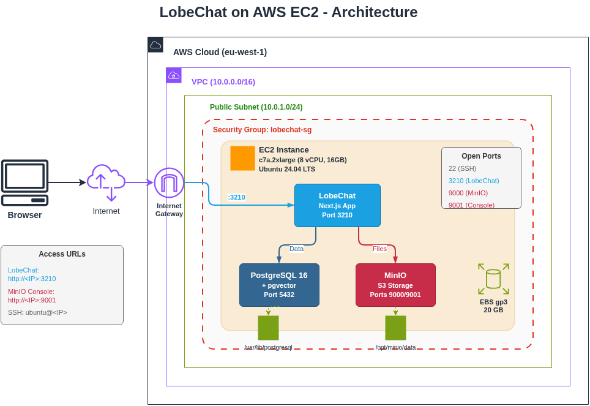

# LobeChat on AWS EC2

Deploy LobeChat on AWS EC2 for ESADE students using the Innovation Sandbox.

---

> **IMPORTANT: STOP YOUR INSTANCE WHEN NOT IN USE**
>
> EC2 instances cost **~$0.35/hour** (~$8.40/day). Always stop your instance when you're done working to avoid unnecessary charges on your sandbox budget.
>
> ```bash
> # Stop instance (from your local machine)
> source ~/.lobechat_aws
> aws ec2 stop-instances --instance-ids $INSTANCE_ID
> ```
>
> When completely finished with the project, **terminate all resources** to stop all billing. See [Cleanup section](docs/INSTALLATION.md#cleanup-when-done---destroy---terminate) in the installation guide.

---

## What You Get

- **LobeChat**: AI chat platform supporting multiple providers (OpenRouter, OpenAI, Anthropic, etc.)
- **PostgreSQL + pgvector**: Database with vector embeddings for semantic search
- **MinIO**: S3-compatible storage for file uploads
- **Better-Auth**: Built-in user authentication

## Quick Start

Follow the step-by-step guide: **[docs/INSTALLATION.md](docs/INSTALLATION.md)**

Total deployment time: ~16 minutes

## Architecture



All services run on a single EC2 instance (Ubuntu 24.04).

## Requirements

| Requirement | Details |
|-------------|---------|
| AWS Account | ESADE Innovation Sandbox |
| Instance Type | c7a.2xlarge (8 vCPU, 16GB RAM) |
| Storage | 20GB gp3 EBS |
| Cost | ~$0.35/hour |

## Access URLs

After installation:

| Service | URL |
|---------|-----|
| LobeChat | `http://<PUBLIC_IP>:3210` |
| MinIO Console | `http://<PUBLIC_IP>:9001` |

## Services

| Service | Port | Purpose |
|---------|------|---------|
| LobeChat | 3210 | Main chat application |
| PostgreSQL | 5432 | Database (internal) |
| MinIO API | 9000 | File storage |
| MinIO Console | 9001 | Storage admin UI |

## Default Credentials

| Service | Username | Password |
|---------|----------|----------|
| MinIO | lobechat | lobechat-minio-secret |
| PostgreSQL | postgres | lobechat-db-password |

LobeChat uses self-registration - create your account on first visit.

## Key Files on EC2

```
/opt/lobechat/           # LobeChat application
├── .env                 # Build-time config
├── .env.local           # Runtime config (systemd reads this)
└── ...

/opt/minio/data/         # MinIO file storage
/var/lib/postgresql/     # PostgreSQL data
```

## Managing the Instance

```bash
# SSH to instance
ssh -i ~/.ssh/lobechat-key.pem ubuntu@<PUBLIC_IP>

# View LobeChat logs
sudo journalctl -u lobechat -f

# Restart services
sudo systemctl restart lobechat
sudo systemctl restart minio
sudo systemctl restart postgresql
```

## Cost Management

- **Stop** instance when not in use: `aws ec2 stop-instances --instance-ids <ID>`
- **Start** when needed: `aws ec2 start-instances --instance-ids <ID>`
- **Terminate** when done (deletes everything): see [Cleanup section](docs/INSTALLATION.md#cleanup-when-done---destroy---terminate)

Note: Public IP changes after stop/start.

## Troubleshooting

See the [Troubleshooting section](docs/INSTALLATION.md#troubleshooting) in the installation guide.

## Version

v1.0.0 - EC2 deployment for ESADE students

---

> **REMINDER: DON'T FORGET TO CLEAN UP**
>
> When you're completely done with your LobeChat deployment, **delete all AWS resources** to avoid any further charges:
>
> - [Cleanup Instructions](docs/INSTALLATION.md#cleanup-when-done---destroy---terminate)
>
> This deletes the EC2 instance, VPC, security groups, and all associated resources. Your sandbox budget is limited - don't waste it on idle resources!
