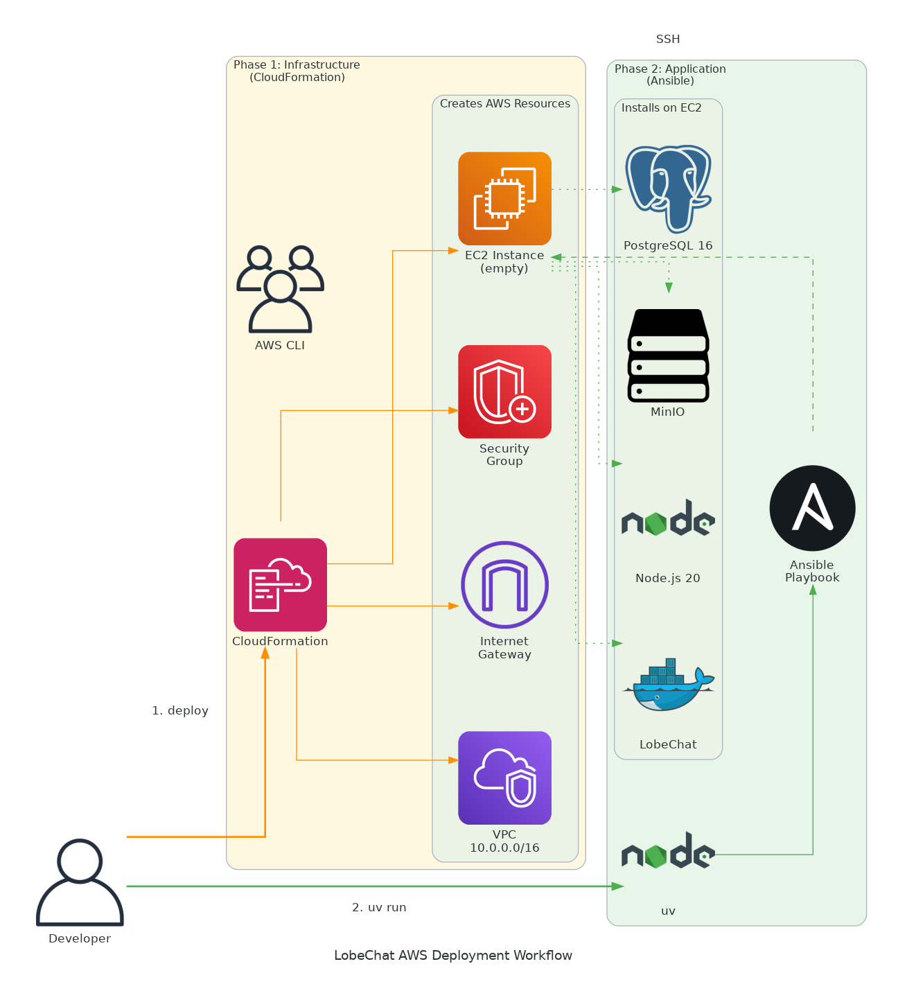
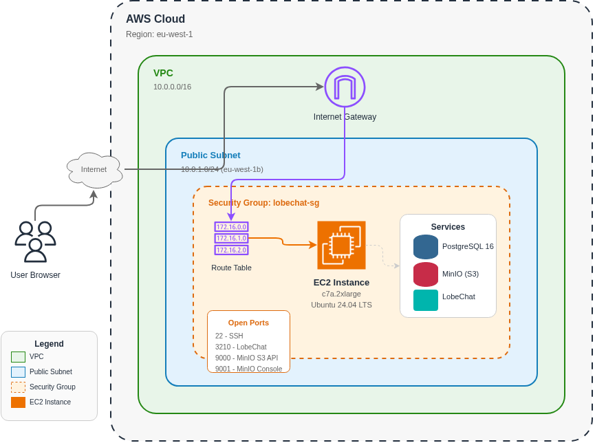

# LobeChat AWS Architecture

This document describes the AWS infrastructure and deployment workflow.

## Deployment Workflow



The deployment uses a two-phase approach:

### Phase 1: Infrastructure (CloudFormation)

CloudFormation creates the AWS resources:

```bash
aws cloudformation deploy \
  --template-file infra/cloudformation.yml \
  --stack-name lobechat \
  --capabilities CAPABILITY_IAM
```

### Phase 2: Application (Ansible)

Ansible configures the EC2 instance via SSH:

```bash
uv run ansible-playbook -i ansible/inventory.yml ansible/playbook.yml
```

### Benefits of This Approach

| Benefit | Description |
|---------|-------------|
| **Separation of concerns** | Infrastructure and application configuration are independent |
| **Idempotent** | Ansible playbook can be re-run safely |
| **Visibility** | Real-time output during deployment |
| **Debuggable** | Easy to troubleshoot failures |
| **Reusable** | Playbook can target different hosts |

---

## Runtime Architecture



## Components

### Networking

| Component | Description | Configuration |
|-----------|-------------|---------------|
| **VPC** | Isolated virtual network | CIDR: 10.0.0.0/16, DNS enabled |
| **Internet Gateway** | Enables internet connectivity | Attached to VPC |
| **Public Subnet** | Hosts the EC2 instance | CIDR: 10.0.1.0/24, AZ: eu-west-1b |
| **Route Table** | Routes traffic to internet | 0.0.0.0/0 → Internet Gateway |

### Security

| Component | Description | Rules |
|-----------|-------------|-------|
| **Security Group** | Firewall for EC2 instance | Inbound ports: 22, 3210, 9000, 9001 |

#### Open Ports

| Port | Service | Purpose |
|------|---------|---------|
| 22 | SSH | Remote administration + Ansible |
| 3210 | LobeChat | Web application |
| 9000 | MinIO S3 API | File storage API |
| 9001 | MinIO Console | Storage management UI |

### Compute

| Component | Description | Specifications |
|-----------|-------------|----------------|
| **EC2 Instance** | Application server | c7a.2xlarge (8 vCPU, 16GB RAM) |
| **OS** | Operating system | Ubuntu 24.04 LTS |
| **Storage** | Root volume | 20GB gp3 EBS |

### Application Stack (Deployed via Ansible)

The EC2 instance runs three services:

| Service | Version | Purpose |
|---------|---------|---------|
| **PostgreSQL** | 16 | Database with pgvector extension for AI embeddings |
| **MinIO** | Latest | S3-compatible object storage for file uploads |
| **LobeChat** | Latest | AI chat application (Next.js) |

---

## Data Flow

1. **User** accesses LobeChat via browser at `http://<PUBLIC_IP>:3210`
2. Traffic enters AWS through the **Internet Gateway**
3. **Route Table** directs traffic to the **Public Subnet**
4. **Security Group** allows traffic on port 3210
5. **EC2 Instance** serves the LobeChat application
6. LobeChat stores data in **PostgreSQL** and files in **MinIO**

---

## CloudFormation Template

The infrastructure is defined in [`infra/cloudformation.yml`](../infra/cloudformation.yml).

### Parameters

| Parameter | Default | Description |
|-----------|---------|-------------|
| `InstanceType` | c7a.2xlarge | EC2 instance size |
| `KeyPairName` | lobechat-key | SSH key pair name |
| `VolumeSize` | 20 | EBS volume size (GB) |

### Outputs

| Output | Description |
|--------|-------------|
| `PublicIP` | EC2 instance public IP address |
| `LobeChatURL` | LobeChat application URL (after Ansible) |
| `MinIOConsoleURL` | MinIO management console URL (after Ansible) |
| `SSHCommand` | SSH connection command |
| `AnsibleCommand` | Ansible playbook command |

---

## Ansible Playbook

The application configuration is defined in [`ansible/playbook.yml`](../ansible/playbook.yml).

### Tasks Overview

| Task Group | Description |
|------------|-------------|
| **System Setup** | Update packages, install dependencies |
| **PostgreSQL** | Install v16, create database, enable pgvector |
| **MinIO** | Install server, create bucket, configure systemd |
| **Node.js** | Install v20, pnpm, bun |
| **LobeChat** | Clone, configure, build, migrate, deploy |

### Variables

| Variable | Default | Description |
|----------|---------|-------------|
| `db_password` | lobechat-db-password | PostgreSQL password |
| `minio_password` | lobechat-minio-secret | MinIO root password |
| `lobechat_user` | ubuntu | System user |
| `lobechat_dir` | /opt/lobechat | Application directory |

---

## Cost Considerations

| Resource | Approximate Cost |
|----------|------------------|
| EC2 c7a.2xlarge | ~$0.35/hour |
| EBS 20GB gp3 | ~$1.60/month |
| Data transfer | Varies by usage |

**Tip**: Delete the CloudFormation stack when not in use to avoid costs.
