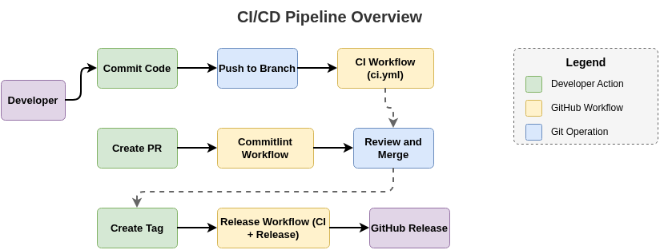
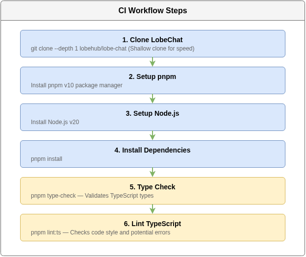
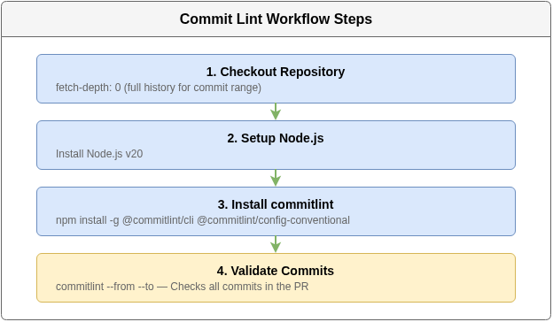
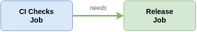
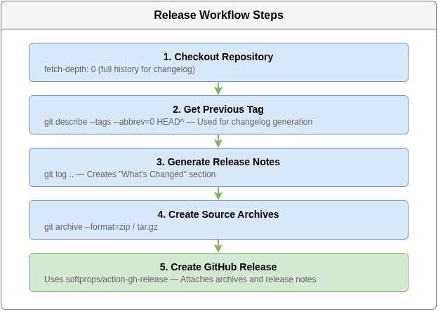
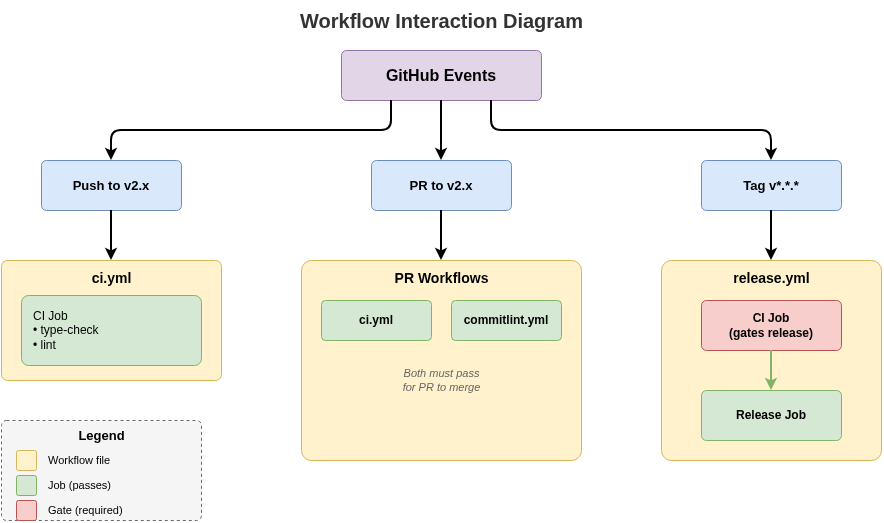

# CI/CD Process Documentation

This document explains the Continuous Integration and Continuous Deployment (CI/CD) pipeline for the lobechat-aws repository.

## Overview

The repository uses GitHub Actions to automate code quality checks and release management. The pipeline ensures that:

1. All commits follow conventional commit format
2. Code passes type checking and linting before release
3. Releases are only created after CI passes



## Workflow Files

All workflows are located in `.github/workflows/`:

| File | Purpose | Trigger |
|------|---------|---------|
| `ci.yml` | Code quality checks | Push/PR to v2.x |
| `commitlint.yml` | Commit message validation | PR to v2.x |
| `release.yml` | Create GitHub releases | Tag push (v*.*.*) |

---

## 1. CI Workflow (`ci.yml`)

### Purpose

Validates code quality by running type checks and linting against the LobeChat codebase.

### Trigger Events

```yaml
on:
  push:
    branches: [v2.x]      # Direct pushes to v2.x
  pull_request:
    branches: [v2.x]      # PRs targeting v2.x
  workflow_dispatch:       # Manual trigger from GitHub UI
```

### Job: `lobechat-checks`



### Configuration Details

- **Timeout**: 15 minutes (prevents hung jobs)
- **Runner**: `ubuntu-latest`
- **Node version**: 20
- **pnpm version**: 10

### Success Criteria

Both `type-check` and `lint:ts` must pass for the workflow to succeed.

---

## 2. Commit Lint Workflow (`commitlint.yml`)

### Purpose

Ensures all commits in a pull request follow the [Conventional Commits](https://conventionalcommits.org) specification.

### Trigger Events

```yaml
on:
  pull_request:
    branches: [v2.x]      # Only PRs to v2.x
```

### Job: `commitlint`



### Conventional Commit Format

```
<type>(<scope>): <description>

[optional body]

[optional footer(s)]
```

**Required**: `<type>: <description>`

### Valid Types

| Type | Description |
|------|-------------|
| `feat` | New feature |
| `fix` | Bug fix |
| `docs` | Documentation changes |
| `style` | Code style (formatting, semicolons) |
| `refactor` | Code refactoring (no feature/fix) |
| `test` | Adding or updating tests |
| `ci` | CI/CD configuration changes |
| `chore` | Maintenance tasks |

### Examples

```bash
# Good commits
docs: add john-doe to homework list
feat: add dark mode support
fix: resolve login timeout issue
ci: update Node.js to v20

# Bad commits (will fail)
Added new feature          # Missing type
feat add dark mode         # Missing colon
FEAT: uppercase type       # Types must be lowercase
```

---

## 3. Release Workflow (`release.yml`)

### Purpose

Creates GitHub releases with source archives when a version tag is pushed. **Importantly, it runs CI checks first** to ensure only passing code is released.

### Trigger Events

```yaml
on:
  push:
    tags:
      - 'v*.*.*'          # Semantic version tags (v1.0.0, v2.1.3, etc.)
```

### Job Dependencies



The `release` job has `needs: ci`, meaning:
- CI must complete successfully before release runs
- If CI fails, no release is created
- This prevents releasing broken code

### Job 1: `ci` (CI Checks)

Runs the same checks as `ci.yml`:
1. Clone LobeChat
2. Setup pnpm and Node.js
3. Install dependencies
4. Run type-check
5. Run lint

### Job 2: `release` (Create Release)



### Release Artifacts

Each release includes:
- `lobechat-aws-v*.*.*.zip` - Source code (ZIP)
- `lobechat-aws-v*.*.*.tar.gz` - Source code (tarball)
- Auto-generated changelog from commits

### Permissions

```yaml
permissions:
  contents: write    # Required to create releases
```

---

## Workflow Interaction Diagram



---

## Creating a Release

### Step-by-Step Process

```bash
# 1. Ensure you're on v2.x with latest changes
git checkout v2.x
git pull origin v2.x

# 2. Verify CI passes locally (optional)
# Push changes and check GitHub Actions

# 3. Create annotated tag
git tag -a v2.2.0 -m "Release v2.2.0: description of changes"

# 4. Push the tag
git push origin v2.2.0

# 5. Watch the workflow
# Go to: GitHub → Actions → Release workflow
```

### What Happens

1. **Tag pushed** → Release workflow triggered
2. **CI job runs** → Type check + lint
3. **If CI passes** → Release job runs
4. **Release created** with:
   - Auto-generated changelog
   - Source archives (.zip, .tar.gz)

### If CI Fails


- Release job is **skipped**
- No release is created
- Fix the issues and create a new tag

---

## Troubleshooting

### CI Workflow Fails

**Check the logs**:
```bash
gh run view --log-failed
```

**Common issues**:
- TypeScript errors → Fix type issues
- Lint errors → Run `pnpm lint:ts --fix` locally

### Commit Lint Fails

**Check your commit messages**:
```bash
# View commits in your PR
git log origin/v2.x..HEAD --oneline

# Test locally
npx commitlint --from origin/v2.x --to HEAD
```

**Fix with interactive rebase**:
```bash
git rebase -i origin/v2.x
# Change 'pick' to 'reword' for bad commits
# Save and edit commit messages
git push --force-with-lease
```

### Release Not Created

1. **Check if CI passed** - Release requires CI to succeed
2. **Check tag format** - Must match `v*.*.*` (e.g., `v2.1.0`)
3. **Check permissions** - Workflow needs `contents: write`

**View workflow runs**:
```bash
gh run list --workflow=release.yml
gh run view <run-id>
```

---

## Best Practices

### Commit Messages

1. Use present tense: "add feature" not "added feature"
2. Keep first line under 72 characters
3. Reference issues: `fix: resolve timeout (#123)`

### Before Creating a Release

1. Ensure all PRs are merged
2. Verify CI passes on v2.x branch
3. Update version following [SemVer](https://semver.org):
   - **MAJOR** (v2.0.0): Breaking changes
   - **MINOR** (v2.1.0): New features (backward compatible)
   - **PATCH** (v2.1.1): Bug fixes

### Branch Protection (Recommended)

Consider enabling branch protection on `v2.x`:
- Require PR reviews
- Require status checks (CI, commitlint)
- Prevent force pushes

---

## Summary

| Workflow | When | What | Blocks Release? |
|----------|------|------|-----------------|
| CI | Push/PR to v2.x | Type check + lint | Yes (via release.yml) |
| Commitlint | PR to v2.x | Validate commit format | No (PR only) |
| Release | Tag v*.*.* | CI + Create release | N/A |

The pipeline ensures:
- Code quality through automated checks
- Consistent commit history via conventional commits
- Reliable releases that only happen after CI passes
