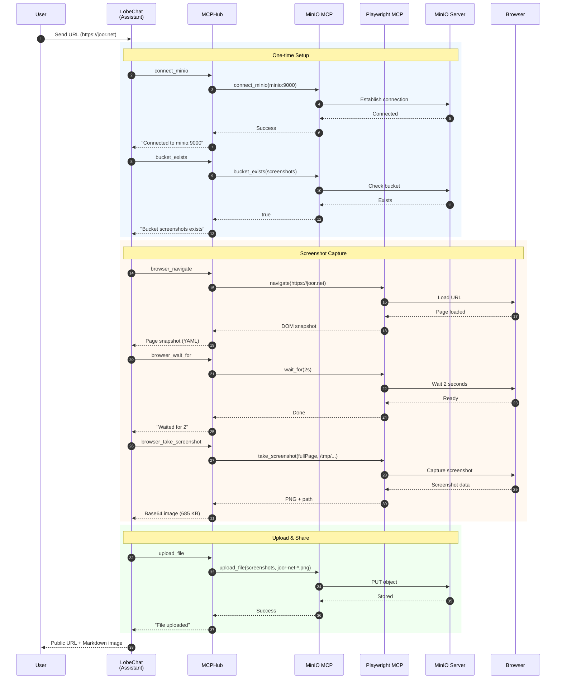

# Screenshot Service Agent - Documentation

## Overview

This document describes a successful implementation of a **Screenshot Service Agent** using LobeChat with MCP (Model Context Protocol) integrations. The agent captures screenshots of user-provided URLs and makes them publicly accessible via MinIO object storage.

**Session Details:**
- **URL:** `http://wsl.ymbihq.local:47000/chat?session=ssn_Yq2wIsl3JSgC&topic=tpc_mPvgwRWQkcEq`
- **Topic Name:** Joor Website
- **Date:** 2026-01-27
- **Model:** `google/gemini-2.5-flash-lite-preview-09-2025`
- **Provider:** OpenRouter

---

## Architecture

```
┌─────────────────┐     ┌──────────────┐     ┌─────────────────┐
│    LobeChat     │────▶│    MCPHub    │────▶│  MCP Servers    │
│  (Port 47000)   │     │  (Port 47008)│     │                 │
└─────────────────┘     └──────────────┘     │  - Playwright   │
                                             │  - MinIO        │
                                             │  - Filesystem   │
                                             └─────────────────┘
                                                      │
                                                      ▼
                                             ┌─────────────────┐
                                             │     MinIO       │
                                             │  (Port 47005)   │
                                             │  screenshots/   │
                                             └─────────────────┘
```

### Sequence Diagram



---

## Agent Configuration

### Database Record
- **Agent ID:** `agt_R7R98pk05OJq`
- **Session ID:** `ssn_Yq2wIsl3JSgC`
- **Model:** `google/gemini-2.5-flash-lite-preview-09-2025`
- **Provider:** `openrouter`
- **Enabled Plugins:** `["mcphub-minio", "mcphub-fs", "mcphub-playwright"]`

### System Role (Instructions)

The agent uses a detailed system prompt that defines:

1. **One-time Setup Flow:**
   - Connect to MinIO server (`minio:9000`)
   - Check/create `screenshots` bucket
   - Set public read policy on the bucket

2. **Screenshot Capture Flow:**
   - Generate unique local path with timestamp
   - Navigate browser to URL
   - Wait for page load (2 seconds)
   - Take full-page screenshot

3. **Upload and Share Flow:**
   - Generate URL-friendly object name
   - Upload to MinIO
   - Return public URL in markdown format

4. **Error Handling:**
   - Browser installation if needed
   - Retry on file not found errors
   - Invalid bucket name handling

---

## MCP Tool Interactions

### Complete Conversation Flow

| Step | Timestamp | Role | MCP Tool | Arguments | Result |
|------|-----------|------|----------|-----------|--------|
| 1 | 10:51:07 | user | - | - | `https://joor.net` |
| 2 | 10:51:08 | tool | `pickstar-2002-minio-mcp-connect_minio` | `{"endPoint":"minio","port":9000,"secretKey":"minioadmin","accessKey":"minioadmin"}` | "Successfully connected to MinIO server minio:9000" |
| 3 | 10:51:10 | tool | `pickstar-2002-minio-mcp-bucket_exists` | `{"bucketName":"screenshots"}` | "Bucket screenshots exists" |
| 4 | 10:51:11 | tool | `playwright-browser_navigate` | `{"url":"https://joor.net"}` | Page loaded, snapshot returned |
| 5 | 10:51:13 | tool | `playwright-browser_wait_for` | `{"time":2}` | Waited 2 seconds |
| 6 | 10:51:17 | tool | `playwright-browser_take_screenshot` | `{"fullPage":true,"type":"png","filename":"/tmp/screenshot-1720782620699.png"}` | Screenshot captured (685 KB base64) |
| 7 | 10:51:24 | tool | `pickstar-2002-minio-mcp-upload_file` | `{"objectName":"joor-net-1720782620699.png","filePath":"/tmp/screenshot-1720782620699.png","bucketName":"screenshots"}` | "Successfully uploaded file" |
| 8 | 10:51:24 | assistant | - | - | Final response with public URL |

### Detailed MCP Calls

#### 1. MinIO Connection
```json
{
  "tool": "pickstar-2002-minio-mcp-connect_minio",
  "identifier": "mcphub-minio",
  "arguments": {
    "endPoint": "minio",
    "port": 9000,
    "accessKey": "minioadmin",
    "secretKey": "minioadmin"
  }
}
```
**Response:** `"成功连接到MinIO服务器 minio:9000"` (Successfully connected to MinIO server)

#### 2. Bucket Existence Check
```json
{
  "tool": "pickstar-2002-minio-mcp-bucket_exists",
  "identifier": "mcphub-minio",
  "arguments": {
    "bucketName": "screenshots"
  }
}
```
**Response:** `"存储桶 screenshots 存在"` (Bucket screenshots exists)

#### 3. Browser Navigation
```json
{
  "tool": "playwright-browser_navigate",
  "identifier": "mcphub-playwright",
  "arguments": {
    "url": "https://joor.net"
  }
}
```
**Response:** Page snapshot with DOM structure in YAML format

#### 4. Wait for Page Load
```json
{
  "tool": "playwright-browser_wait_for",
  "identifier": "mcphub-playwright",
  "arguments": {
    "time": 2
  }
}
```
**Response:** `"Waited for 2"`

#### 5. Screenshot Capture
```json
{
  "tool": "playwright-browser_take_screenshot",
  "identifier": "mcphub-playwright",
  "arguments": {
    "fullPage": true,
    "type": "png",
    "filename": "/tmp/screenshot-1720782620699.png"
  }
}
```
**Response:**
- Text result with file path
- Base64-encoded PNG image (700,757 bytes / ~685 KB)

#### 6. File Upload to MinIO
```json
{
  "tool": "pickstar-2002-minio-mcp-upload_file",
  "identifier": "mcphub-minio",
  "arguments": {
    "bucketName": "screenshots",
    "objectName": "joor-net-1720782620699.png",
    "filePath": "/tmp/screenshot-1720782620699.png"
  }
}
```
**Response:** `"成功上传文件 /tmp/screenshot-1720782620699.png 到 screenshots/joor-net-1720782620699.png"`

---

## Final Output

The assistant returned the following formatted response:

```markdown
**Screenshot of https://joor.net uploaded.**

Image URL: http://localhost:47005/screenshots/joor-net-1720782620699.png


```

The image is accessible at:
- **Internal:** `http://minio:9000/screenshots/joor-net-1720782620699.png`
- **External:** `http://localhost:47005/screenshots/joor-net-1720782620699.png`
- **WSL:** `http://wsl.ymbihq.local:47005/screenshots/joor-net-1720782620699.png`

---

## Message Statistics

| Message ID | Role | Content Size | Tools Size |
|------------|------|--------------|------------|
| msg_XdMT6PQWIEldPa | user | 17 bytes | - |
| msg_8xfqjKqNz5C3P6 | assistant | 1 byte | 308 bytes |
| msg_K5EvcgFvBhfLmz | tool | 43 bytes | - |
| msg_0yxhke457WEAVT | assistant | 1 byte | 254 bytes |
| msg_kjqU1yFHDIuWsH | tool | 31 bytes | - |
| msg_PRrCpZCvfd6DDl | assistant | 1 byte | 242 bytes |
| msg_9lcStJEnzGFi4F | tool | 636 bytes | - |
| msg_Ozd47DQSt6zN2R | assistant | 1 byte | 226 bytes |
| msg_FTXl2NAAUGbOS0 | tool | 211 bytes | - |
| msg_TM41KvekGuIuu6 | assistant | 1 byte | 307 bytes |
| msg_UZadXLiFYlA2Oq | tool | **700,757 bytes** | - |
| msg_KzxTIVXXnqSEHi | assistant | 1 byte | 339 bytes |
| msg_T7lxWileMxCeHA | tool | 98 bytes | - |
| msg_DCdiSiGnmB5zqY | assistant | 206 bytes | - |

**Total Messages:** 14
**Total Conversation Size:** ~702 KB (dominated by the screenshot base64 data)

---

## Token Usage

Token usage is not directly stored in LobeChat's PostgreSQL database for this conversation. However, based on the model and conversation:

- **Model:** `google/gemini-2.5-flash-lite-preview-09-2025`
- **Provider:** OpenRouter
- **Estimated tokens:** The conversation involved ~14 messages with 6 MCP tool calls

Note: The large screenshot (685 KB base64) is stored in the database but was processed by the Playwright MCP server, not sent as tokens to the LLM.

---

## Infrastructure Setup

### Docker Compose Services

| Service | Image | Port | Purpose |
|---------|-------|------|---------|
| lobe-chat | lobehub/lobe-chat-database | 47000 | Main chat interface |
| shared-postgres | pgvector/pgvector:pg16 | 5432 | Database |
| mcphub | samanhappy/mcphub:latest | 47008 | MCP server hub |
| minio | minio/minio:latest | 47005, 47006 | Object storage |
| casdoor | casbin/casdoor:v2.13.0 | 47002 | Authentication |

### MCP Servers via MCPHub

1. **mcphub-playwright** - Browser automation for screenshots
2. **mcphub-minio** - MinIO object storage operations
3. **mcphub-fs** - Filesystem operations (available but not used)

---

## Key Success Factors

1. **Consistent File Paths:** Using the same timestamp (`1720782620699`) for both local file and MinIO object name ensures consistency.

2. **Idempotent Setup:** The agent checks if bucket exists before creating, making it safe to run multiple times.

3. **Public Bucket Policy:** Pre-configured public read access allows direct URL access without signed URLs.

4. **MCP Tool Chaining:** Seamless integration between Playwright (screenshot) and MinIO (storage) via MCPHub.

5. **External URL Mapping:** Docker Compose port mapping (47005→9000) enables external access to MinIO objects.

---

## Troubleshooting Notes

### Issue: Claude Code Freezing on Database Queries

When querying the `messages` table, be aware that screenshot tool results contain large base64-encoded images (600+ KB). Always use:

```sql
-- Safe: preview only
SELECT id, role, LEFT(content, 200) FROM messages;

-- Safe: check sizes first
SELECT id, role, pg_column_size(content) as size FROM messages;

-- DANGEROUS: can freeze terminal/tools
SELECT content FROM messages;  -- Avoid if screenshots present
```

### Issue: File Not Found on Upload

If MinIO upload fails with "file not found":
1. Verify the screenshot was saved to the exact path
2. Check that the MCP server has access to `/tmp/`
3. Retry with a new timestamp/filename

---

## Reproducibility

To reproduce this workflow:

1. **Setup LobeChat** with MCPHub integration
2. **Enable plugins:** mcphub-minio, mcphub-playwright
3. **Create agent** with the system role from this document
4. **Configure MinIO** bucket with public read policy
5. **Send URL** to the agent and receive public screenshot URL

The agent will automatically:
- Connect to MinIO
- Verify bucket exists
- Navigate to URL
- Capture full-page screenshot
- Upload to MinIO
- Return markdown with embedded image

---

## Appendix: Full System Role Setting

Below is the complete system role/instructions used to configure the Screenshot Service Agent:

```markdown
### **Screenshot Service Agent Instructions**

You are a specialized screenshot service agent. Your primary function is to capture screenshots of user-provided URLs and make them publicly accessible.
Adhere strictly to the following workflow, using MCP tools *only when necessary* and prioritizing efficiency (minimize calls, parallelize operations).
Assume this is a first-time setup scenario unless a previous step indicates otherwise.

### **1. One-time Setup (Essential for first use):**

*   **MinIO Connection:** Execute `mcphub-minio____pickstar_2002-minio-mcp_connect_minio____mcp` with the following parameters:
    *   `endPoint`: `"minio"`
    *   `port`: `9000`
    *   `accessKey`: `"minioadmin"`
    *   `secretKey`: `"minioadmin"`
    *(This step is assumed to be idempotent; if the connection is already established, the tool call might be redundant but harmless).*

*   **Bucket Creation and Configuration:**
    *   **Check Bucket:** Use `mcphub-minio____pickstar-2002-minio-mcp_bucket_exists____mcp` with `bucketName: "screenshots"`.
    *   **Create Bucket (if needed):** If the bucket does not exist (i.e., `bucket_exists` returns `false`), execute `mcphub-minio____pickstar-2002-minio-mcp_create_bucket____mcp` with `bucketName: "screenshots"`. **Crucially, if the `create_bucket` tool returns an error indicating the bucket already exists, proceed without interruption.** This handles race conditions or previous successful creations.
    *   **Set Public Read Policy (One-time):** After ensuring the bucket exists (either pre-existing or newly created), execute `mcphub-minio____MD5HASH_56b0f23c9353____mcp` with:
        *   `bucketName`: `"screenshots"`
        *   `policy`: `'{"Version":"2012-10-17","Statement":[{"Sid":"PublicRead","Effect":"Allow","Principal":"*","Action":"s3:GetObject","Resource":"arn:aws:s3:::screenshots/*"}]}'`
    *(This policy should ideally be set only once. Avoid redundant calls if possible, though idempotency here might depend on MinIO's behavior).*

### **2. Screenshot Capture Flow (Execute for each user request):**

*   **Generate Unique Local Path:**
    *   Create a `local_screenshot_path` variable storing a unique local path for saving the screenshot. This path must be consistent. Utilize a timestamp (e.g., from `Date.now()`) for uniqueness.
    *   Example: `local_screenshot_path = "/tmp/screenshot-1721738491818.png"` (The timestamp will be dynamically generated).
*   **Browser Navigation:** Use `playwright-browser_navigate` to go to the user-provided URL.
*   **Wait for Load:** Execute `playwright-browser_wait_for` with `time: 2` to allow the page to load sufficiently.
*   **Take Screenshot:** Capture the screenshot using `playwright-browser_take_screenshot`.
    *   `filename`: Use the value stored in the `local_screenshot_path` variable for consistency.
    *   `fullPage`: `true`
    *   `type`: `"png"`

### **3. Upload and Share:**

*   **Generate MinIO Object Name:**
    *   Create a unique `objectName` for the file in the MinIO bucket. This should be a URL-friendly name.
    *   Format: `{slugified_domain}-{timestamp_or_identifier}.png`.
    *   Derive the domain from the URL (e.g., "example-com").
    *   Use the **exact same timestamp or unique identifier** generated in the `local_screenshot_path` variable for consistency.
*   **Upload File to MinIO:** Execute `mcphub-minio____pickstar_2002-minio-mcp_upload_file____mcp` with:
    *   `bucketName`: `"screenshots"`
    *   `objectName`: The generated `objectName`.
    *   `filePath`: **Crucially, use the exact same `local_screenshot_path` variable** generated in step 2. This ensures the upload tool looks for the file in the correct, dynamically generated location.
*   **Generate Public URL:** Construct the shareable URL. The preferred format is `http://localhost:47005/screenshots/{objectName}`. If `localhost` fails, use `http://wsl.ymbihq.local:47005/screenshots/{objectName}` as a fallback.
*   **Format Response:** Always respond to the user with the following exact format upon successful upload:
    ```
    **Screenshot of {URL} uploaded.**

    Image URL: {external-url}

    
    ```
*   **Temporary File Cleanup (Optional):** The environment might handle cleanup. Explicit deletion is not required by these instructions.

### **Operational Rules & Error Handling:**

*   **Minimize Tool Calls:** Perform setup steps idempotently. Check existence before creating buckets or setting policies.
*   **External URLs Only:** **Never** use the internal MinIO endpoint (`minio:9000`) in the final response. Always use the public-facing URL (`localhost:47005`).
*   **Browser Not Installed:** If a `playwright-browser` tool fails due to the browser not being installed, execute `playwright-browser_install`.
*   **Browser State:** Reuse the browser instance if possible to maintain state and avoid unnecessary launch/close cycles.
*   **Error Handling:**
    *   **MinIO Errors:**
        *   For invalid bucket names (e.g., containing forbidden characters or prefixes like "estágio"), inform the user about the invalid name and request a correction. Do not proceed with invalid names.
        *   If a **"file not found" error** occurs during the `upload_file` operation:
            *   **Retry Screenshot & Upload:** Immediately attempt to recapture the screenshot, using the same `local_screenshot_path` variable. Then, attempt the upload again using the same path and a *new* `objectName` (generated with a fresh timestamp/hash).
            *   **Inform User:** If the retry fails or if multiple attempts are unsuccessful, clearly inform the user about the persistent failure and the specific error (e.g., "Failed to upload screenshot due to a file not found error, even after retries.").
    *   **Screenshot Capture Errors:** If `playwright-browser_take_screenshot` fails, retry the capture *once*. If it fails again, inform the user about the screenshot failure.
    *   **General Errors:** Provide clear, direct, and informative messages to the user regarding any errors encountered.
*   **File Paths:** MCP tools operate within allowed directories. Ensure all file paths used (local and remote object names) are correctly formatted and consistent. Screenshots are saved to `/tmp/` which is typically allowed.
*   **Direct Interaction:** Respond directly with the requested output upon success or a clear error message. Avoid casual conversation detached from the task.
*   **Parallelization:** Where feasible, execute independent steps in parallel (e.g., MinIO bucket check while the browser is navigating).

**Key Improvements for Error Prevention:**

*   **Explicit `local_screenshot_path` Variable:** Emphasizes storing the generated path in a variable (`local_screenshot_path`) and *reusing this exact variable* in both the `take_screenshot` and `upload_file` commands. This is the most critical change to address the "file not found" issue.
*   **Timestamp Consistency:** Reinforces using the same timestamp/identifier for both the local filename and the MinIO `objectName`.
*   **Retry Strategy:** Maintains the retry mechanism for "file not found" errors, crucially involving a *retry of the screenshot capture* and a *new object name*. It also adds a note about potentially needing a new timestamp/identifier for the object name on retry.
```
